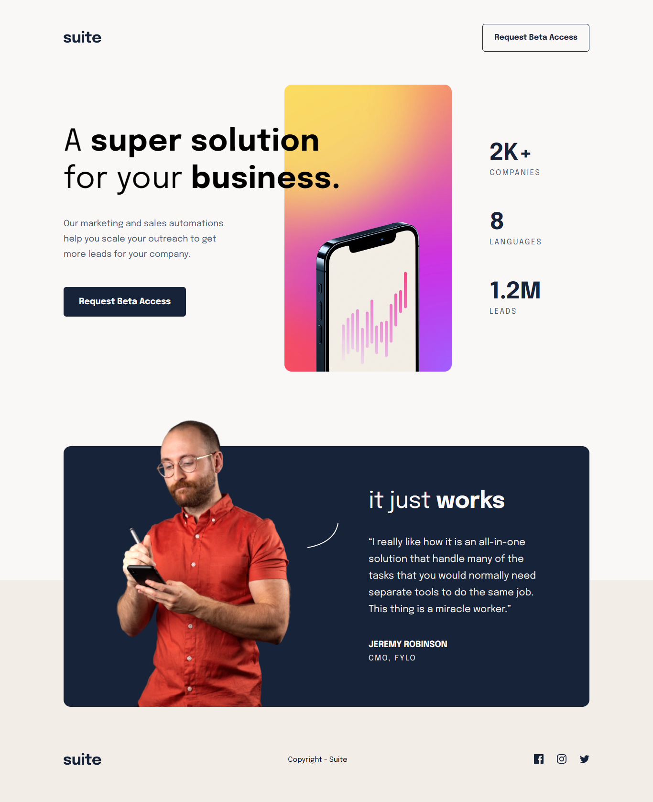

# Suite Landing Page

This is a solution to the **Suite landing page** challenge from [Frontend Mentor](https://www.frontendmentor.io/challenges/suite-landing-page-tj_eaU-Ra). The goal of the project was to build a responsive landing page using only HTML and CSS.

## 🖼️ Preview

## 🚀 Live Demo

* Live site: [https://sirrryasir.github.io/suite-landing-page](https://sirrryasir.github.io/suite-landing-page)
* Solution on Frontend Mentor: [https://www.frontendmentor.io/profile/YazyDev](https://www.frontendmentor.io/profile/YazyDev)

## 🧠 What I Learned

* How to use the `<picture>` element for responsive images
* Media queries for different screen sizes
* Building a responsive layout using **Flexbox** and **Grid**
* How to structure a clean HTML/CSS project

## 🛠️ Built With

* HTML5 semantic markup
* CSS3 custom properties
* Flexbox
* CSS Grid
* Mobile-first workflow

## 📌 Future Improvements

* Improve accessibility with ARIA attributes
* Add smooth transitions and animations
* Explore adding JavaScript for interactivity

## 📚 Resources

* [MDN Web Docs](https://developer.mozilla.org/)
* [CSS Tricks – Flexbox Guide](https://css-tricks.com/snippets/css/a-guide-to-flexbox/)
* [Frontend Mentor Community](https://frontendmentor.io/community)

## 🙋‍♂️ Author

* Name: **Yasir Hassan** (**Yazy**)
* Frontend Mentor: [@YazyDev](https://www.frontendmentor.io/profile/ziryazy)
* Twitter: [@Yazy\_Dev](https://twitter.com/sirrryasir)
